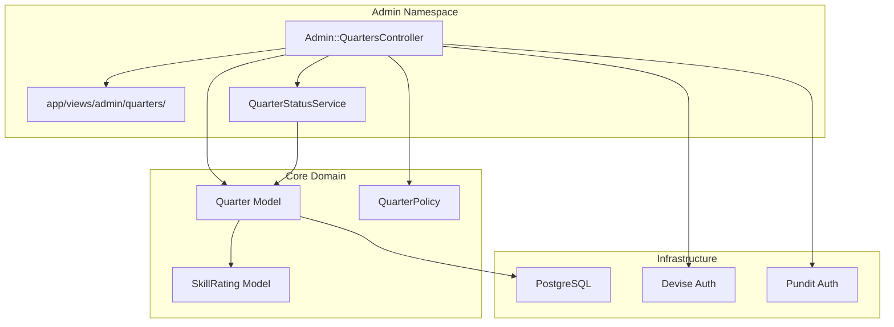
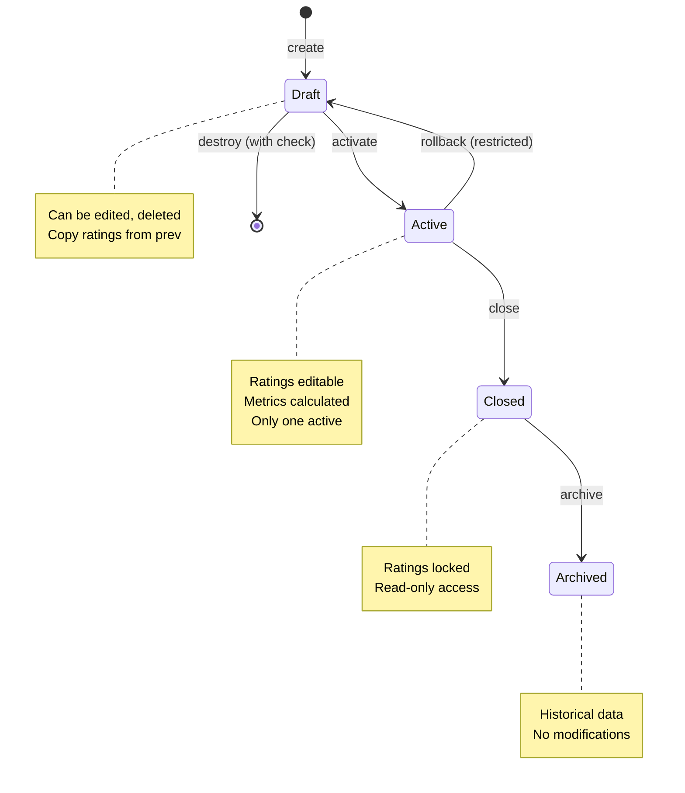
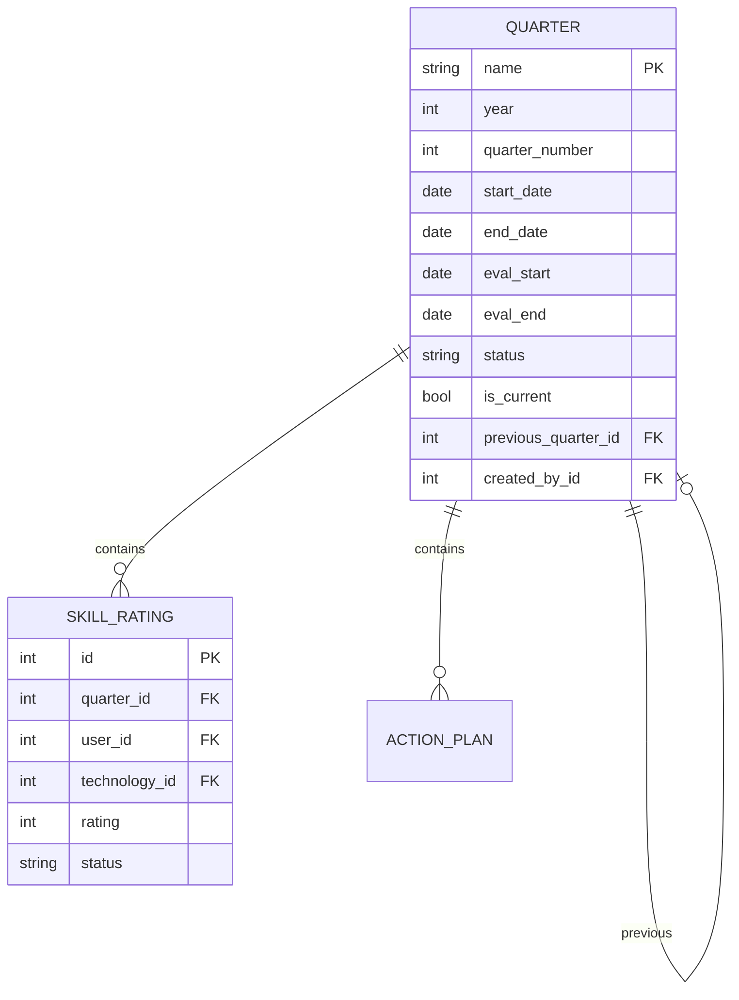

# Technical Design Document: Admin Quarter Management

## Overview

Данный дизайн описывает создание административного интерфейса для управления квартальными циклами в системе Starmap. Функция предоставляет администраторам возможность создавать новые кварталы, управлять их жизненным циклом (draft → active → closed → archived) и контролировать связанные данные.

**Target Users**: Администраторы (Admin) и Руководители направлений (Unit Lead) получают инструмент для управления циклами оценки компетенций.

**Impact**: Добавляет новый административный namespace `/admin/quarters` с полным CRUD-интерфейсом для управления кварталами, используя существующую модель Quarter и расширяя её сервисным слоем для сложных операций.

### Goals
- Создать интуитивный интерфейс для управления кварталами через админ-панель
- Обеспечить четкий workflow переходов между статусами кварталов
- Интегрироваться с существующей системой аутентификации и авторизации
- Поддержать inline-редактирование через Turbo Frames для улучшения UX

### Non-Goals
- Создание полноценной CMS или generic admin-панели
- Реализация bulk-операций над несколькими кварталами одновременно
- Интеграция с внешними календарными системами
- Мобильная версия админ-интерфейса (в рамках текущего этапа)

## Architecture

### Existing Architecture Analysis

Система Starmap использует стандартную Rails MVC архитектуру с Hotwire:

```
Presentation (Hotwire: Turbo + Stimulus + ERB Views)
├─ Controllers (Rails MVC с Pundit авторизацией)
├─ Models (ActiveRecord с бизнес-логикой)
├─ Views (ERB partials, без хелперов и компонентов)
└─ Data Layer (PostgreSQL)
```

**Существующие компоненты, которые будут использованы**:
- Модель `Quarter` с полной бизнес-логикой валидаций и переходов состояний
- Политики `QuarterPolicy` с матрицей доступа
- Базовый `ApplicationController` с Devise и Pundit интеграцией

### Architecture Pattern & Boundary Map

**Selected Pattern**: Namespace-based Administration с Service Layer для сложных операций

**Domain Boundaries**:
- `Admin::` namespace изолирует административную логику от публичного интерфейса
- `QuarterStatusService` инкапсулирует сложные переходы состояний
- ERB views с прямой логикой отображения (без хелперов и компонентов)



**Steering Compliance**:
- Hotwire over SPA: Используем Turbo Frames для частичного обновления
- Pundit Authorization: Проверка прав на каждом действии
- Single Responsibility: Service-объект для сложных операций
- ERB Views: Простые partials без дополнительных абстракций

### Technology Stack

| Layer | Choice / Version | Role in Feature | Notes |
|-------|------------------|-----------------|-------|
| Frontend | Hotwire (Turbo + Stimulus) | Partials updates without page reload | Turbo Frames for inline editing |
| Backend | Ruby 3.2+, Rails 8.1 | Controller logic and service layer | Namespace: Admin:: |
| Data | PostgreSQL 15+ | Quarter data persistence | No schema changes needed |
| Views | ERB Partials | UI rendering | No helpers, no components |
| Auth | Devise + Pundit | Authentication and authorization | Existing policies reused |
| Testing | RSpec + FactoryBot | Controller and request specs | Follows existing patterns |

## System Flows

### Quarter Status Transition Flow



## Requirements Traceability

| Requirement | Summary | Components | Interfaces | Flows |
|-------------|---------|------------|------------|-------|
| 1.1 | Страница списка кварталов | Admin::QuartersController#index, index view | GET /admin/quarters | Quarter listing |
| 1.2 | Кнопка создания квартала | Admin::QuartersController#new, form partial | GET /admin/quarters/new | Form display |
| 1.3 | Отображение метрик в списке | index view (logic inline) | Quarter#rating_completion_percentage | Metrics display |
| 1.4-1.5 | Авторизация админа | QuarterPolicy#can_manage_quarters?, ApplicationController | Pundit authorization | Access control |
| 2.1 | Создание квартала | Admin::QuartersController#create, Quarter model | POST /admin/quarters | Create flow |
| 2.2 | Авторассчет дат | Quarter#calculate_evaluation_dates (callback) | Model validation | Auto-calculation |
| 2.3 | Валидация уникальности | Quarter validations | Model errors | Validation flow |
| 2.4 | Ограничение периодов | Quarter validations | Year/quarter_number checks | Date validation |
| 3.1 | Активация квартала | QuarterStatusService#activate, copy_previous_ratings | POST /admin/quarters/:id/activate | Activation flow |
| 3.3 | Закрытие квартала | QuarterStatusService#close | POST /admin/quarters/:id/close | Close flow |
| 3.4 | Архивирование | QuarterStatusService#archive | POST /admin/quarters/:id/archive | Archive flow |
| 3.5 | Проверка активных кварталов | QuarterStatusService validations | Business rule check | Validation flow |
| 4.1 | Детальный просмотр | Admin::QuartersController#show | GET /admin/quarters/:id | Show flow |
| 4.2 | Редактирование черновика | Admin::QuartersController#edit, update | GET/PUT /admin/quarters/:id | Edit flow |
| 4.3 | Read-only для не-черновиков | form partial (disabled state logic) | UI state check | Display logic |
| 4.5 | Отображение связанных метрик | show view (logic inline) | Quarter aggregate methods | Metrics flow |
| 5.1 | Удаление черновика | Admin::QuartersController#destroy | DELETE /admin/quarters/:id | Destroy flow |
| 5.2 | Предупреждение о связанных данных | destroy confirmation view | dependent: :destroy check | Warning flow |
| 5.4 | Блокировка удаления не-черновиков | QuarterPolicy#destroy?, Admin::QuartersController | Status check | Authorization flow |

## Components and Interfaces

### Component Summary

| Component | Domain/Layer | Intent | Req Coverage | Key Dependencies | Contracts |
|-----------|--------------|--------|--------------|------------------|-----------|
| Admin::QuartersController | Controller | HTTP handling for quarter CRUD | 1.1, 1.2, 2.1, 4.1, 4.2, 5.1 | QuarterPolicy (P0), QuarterStatusService (P1) | Service, API |
| QuarterStatusService | Service | Complex status transitions | 3.1, 3.3, 3.4, 3.5 | Quarter model (P0), SkillRating model (P1) | Service |
| index.html.erb | View | Quarter list display with actions | 1.1, 1.3 | Quarter collection (P0) | State |
| _form.html.erb | Partial | Create/edit form with validation | 1.2, 2.1, 4.2, 4.3 | Quarter model (P0) | State |
| show.html.erb | View | Quarter detail with metrics | 4.1, 4.5 | Quarter (P0) | State |
| _quarter.html.erb | Partial | Single quarter row for list | 1.1, 1.3 | Quarter (P0) | State |

### Admin::QuartersController

| Field | Detail |
|-------|--------|
| Intent | HTTP request handling for quarter administration |
| Requirements | 1.1, 1.2, 2.1, 4.1, 4.2, 5.1 |

**Responsibilities & Constraints**
- HTTP routing and parameter handling
- Authorization enforcement via Pundit
- Service object delegation for complex operations
- Flash message handling and redirection
- Turbo Frame response support

**Dependencies**
- Inbound: Devise (authentication - P0), Pundit (authorization - P0)
- Outbound: QuarterStatusService (status transitions - P1), Quarter model (data - P0)
- External: PostgreSQL (storage - P0)

**Contracts**: Service [✓] / API [✓] / Event [ ] / Batch [ ] / State [ ]

##### Service Interface

```ruby
# QuarterStatusService interface
class QuarterStatusService
  def initialize(quarter, current_user)
    @quarter = quarter
    @current_user = current_user
  end

  def activate!
    # Precondition: quarter.status == 'draft'
    # Postcondition: quarter.status == 'active', ratings copied if previous exists
    # Errors: TransitionError if another active quarter exists
  end

  def close!
    # Precondition: quarter.status == 'active'
    # Postcondition: quarter.status == 'closed', ratings locked
  end

  def archive!
    # Precondition: quarter.status == 'closed'
    # Postcondition: quarter.status == 'archived'
  end

  def can_activate?
    # Returns: Boolean, checks business rules
  end
end
```

##### API Contract

| Method | Endpoint | Request | Response | Errors |
|--------|----------|---------|----------|--------|
| GET | /admin/quarters | - | Quarter[] list | 403 |
| GET | /admin/quarters/new | - | Form (new Quarter) | 403 |
| POST | /admin/quarters | Quarter params | Redirect to index | 400, 403, 422 |
| GET | /admin/quarters/:id | - | Quarter detail | 403, 404 |
| GET | /admin/quarters/:id/edit | - | Form (edit Quarter) | 403, 404 |
| PUT | /admin/quarters/:id | Quarter params | Redirect to show | 400, 403, 404, 422 |
| DELETE | /admin/quarters/:id | - | Redirect to index | 403, 404, 422 |
| POST | /admin/quarters/:id/activate | - | Redirect to show | 403, 404, 422 |
| POST | /admin/quarters/:id/close | - | Redirect to show | 403, 404, 422 |
| POST | /admin/quarters/:id/archive | - | Redirect to show | 403, 404, 422 |

**Implementation Notes**
- Integration: Namespace under `admin/` for clear separation
- Validation: Strong parameters permit only allowed fields
- Risks: Race conditions during status transitions - use database transactions

### Views Structure

**index.html.erb** - Список кварталов
- Отображает таблицу со всеми кварталами
- Логика отображения кнопок действий через `if policy(quarter).action?`
- Статусы отображаются с CSS классами напрямую во view
- Метрики получаются через методы модели (@quarter.total_skill_ratings и т.д.)

**_form.html.erb** - Форма создания/редактирования
- Рендерит поля формы через Rails helpers
- Условное отображение: `if @quarter.draft?` для редактируемых полей
- Валидационные ошибки отображаются через `<%= render 'errors', object: @quarter %>`

**show.html.erb** - Детальный просмотр
- Отображает все атрибуты квартала
- Метрики через прямые вызовы методов модели
- Действия (activate, close, archive) с проверкой прав

**_quarter.html.erb** - Частичный шаблон для строки таблицы
- Используется для рендеринга каждого квартала в списке
- Получает quarter как локальную переменную

### QuarterStatusService

| Field | Detail |
|-------|--------|
| Intent | Encapsulate complex quarter status transitions |
| Requirements | 3.1, 3.3, 3.4, 3.5 |

**Responsibilities & Constraints**
- Validate business rules for each transition
- Handle side effects (copy ratings, lock ratings)
- Ensure atomicity via database transactions
- Return meaningful error messages

**Dependencies**
- Inbound: Quarter model (P0), Current user (P0)
- Outbound: Quarter model (updates) (P0), SkillRating model (P1)
- External: PostgreSQL transactions (P0)

**Contracts**: Service [✓] / API [ ] / Event [ ] / Batch [ ] / State [ ]

##### Service Interface

```ruby
class QuarterStatusService
  class TransitionError < StandardError; end
  class ValidationError < StandardError; end

  def self.activate!(quarter, user)
    new(quarter, user).activate!
  end

  def activate!
    # Validations:
    # - quarter.status must be 'draft'
    # - No other active quarters (or force: true)
    # - Previous quarter exists for copying (optional)
    
    # Actions:
    # - Copy ratings from previous_quarter if exists
    # - Update status to 'active'
    # - Set is_current if no current exists
    
    # Returns: true on success, raises TransitionError on failure
  end

  def close!
    # Validations: status == 'active'
    # Actions: Update status, lock skill_ratings
  end

  def archive!
    # Validations: status == 'closed'
    # Actions: Update status
  end

  def can_destroy?
    # Validations: status == 'draft', no dependent records (or force)
  end
end
```

**Implementation Notes**
- Integration: Called from controller actions
- Validation: Check all preconditions before database transaction
- Risks: Ensure idempotency for retry scenarios

## Data Models

### Domain Model

**Quarter Aggregate**
- **Root**: Quarter entity
- **Value Objects**: Date ranges (start_date, end_date, evaluation_dates)
- **Associated Entities**: SkillRating[], ActionPlan[]
- **Invariants**:
  - Only one Quarter can be `is_current: true`
  - Status transitions follow: draft → active → closed → archived
  - Quarter name unique within year scope
  - Evaluation period must be within quarter dates



### Logical Data Model

**No schema changes required** - существующая модель Quarter полностью покрывает требования.

**Consistency & Integrity**:
- Transaction boundaries: Service layer wraps status transitions в transactions
- Cascading rules: `dependent: :destroy` настроен на quarter.has_many :skill_ratings
- Temporal aspects: Модель Quarter сама управляет датами через callbacks

### Data Contracts & Integration

**API Data Transfer**

Request/Response schemas для Quarter management:

```ruby
# POST /admin/quarters (Create)
params.require(:quarter).permit(
  :name, :year, :quarter_number, 
  :start_date, :end_date,
  :evaluation_start_date, :evaluation_end_date,
  :description
)

# Response: Redirect to index or 422 with errors

# PUT /admin/quarters/:id (Update)
# Same params as create, but year/quarter_number typically immutable
# Validation: Only draft quarters editable

# POST /admin/quarters/:id/activate (Custom action)
# No body required
# Response: Redirect to show or error
```

**Validation Rules**:
- `year`: Integer > 2000
- `quarter_number`: Integer in [1, 2, 3, 4]
- `start_date` < `end_date`
- `evaluation_start_date` < `evaluation_end_date`
- Both evaluation dates within [start_date, end_date]
- `name`: Unique within `year` scope
- `year` + `quarter_number` combination unique

## Error Handling

### Error Strategy

**Fail Fast** с **Graceful Degradation**:
- Валидации на уровне модели и сервиса ловят ошибки рано
- Пользователю показываются понятные сообщения с контекстом
- Для системных ошибок - логирование и generic сообщение

### Error Categories and Responses

**User Errors (4xx)**:
- 400 Bad Request: Невалидные параметры формы
  - Response: Re-render form с errors
  - Message: "Проверьте правильность заполнения полей"
  
- 403 Forbidden: Недостаточно прав
  - Response: Redirect to root с alert
  - Message: "У вас нет прав для выполнения этого действия"
  
- 404 Not Found: Квартал не найден
  - Response: Redirect to quarters list
  - Message: "Квартал не найден"
  
- 422 Unprocessable Entity: Бизнес-правила нарушены
  - Response: Re-render с ошибками валидации
  - Examples: "Нельзя активировать квартал - уже есть активный", "Нельзя удалить - есть связанные данные"

**System Errors (5xx)**:
- 500 Internal Server Error: Database/Service failures
  - Response: Generic error page
  - Action: Log error, notify monitoring
  - Recovery: Transaction rollback автоматический

**Business Logic Errors (422)**:
- Invalid status transition
  - Example: "Нельзя перейти из статуса 'archived' в 'active'"
  - 
- Quarter overlap
  - Example: "Квартал с такими датами уже существует"

### Monitoring

**Error Tracking**:
- Rails.logger.error для всех сервисных ошибок
- Exception notification для 500 ошибок

## Testing Strategy

### Unit Tests

**QuarterStatusService**:
1. `activate!` - успешная активация черновика
2. `activate!` - ошибка если уже есть активный квартал
3. `activate!` - копирование рейтингов из предыдущего квартала
4. `close!` - закрытие активного квартала и блокировка рейтингов
5. `archive!` - архивирование закрытого квартала

### Integration Tests (Request Specs)

**Controller**:
6. GET /admin/quarters - успешное получение списка
7. POST /admin/quarters - создание с валидными данными
8. POST /admin/quarters - ошибка с невалидными данными
9. PUT /admin/quarters/:id - обновление черновика
10. PUT /admin/quarters/:id - ошибка при попытке редактировать не-черновик
11. DELETE /admin/quarters/:id - удаление черновика
12. DELETE /admin/quarters/:id - ошибка при удалении активного
13. POST /admin/quarters/:id/activate - активация
14. Authorization - 403 для не-админов

### System Tests (E2E)

15. Полный flow создания квартала от начала до активации
16. Попытка редактирования закрытого квартала (должна быть заблокирована)
17. Удаление квартала с подтверждением

## Security Considerations

**Authentication & Authorization**:
- Все actions через Devise `authenticate_user!`
- Pundit проверка на каждом действии через `authorize`
- QuarterPolicy.can_manage_quarters? требует admin? || unit_lead?

**Data Protection**:
- Strong parameters - только разрешенные поля
- No mass assignment vulnerabilities
- CSRF protection через Rails defaults

## Performance & Scalability

**Optimizations**:
- Eager loading в index action: `includes(:skill_ratings, :action_plans)`
- Pagination через Kaminari: 25 items per page

**Targets**:
- Page load < 200ms для списка кварталов (95th percentile)
- Status transition < 500ms (включая копирование рейтингов)
- Support for 100+ quarters without pagination degradation

## Files Structure

```
app/
├── controllers/
│   └── admin/
│       └── quarters_controller.rb
├── services/
│   └── quarter_status_service.rb
├── views/
│   └── admin/
│       └── quarters/
│           ├── index.html.erb
│           ├── show.html.erb
│           ├── new.html.erb
│           ├── edit.html.erb
│           ├── _form.html.erb
│           ├── _quarter.html.erb
│           └── _errors.html.erb
config/
└── routes.rb (namespace :admin)
```

---

## Research Log Reference

Подробный анализ существующего кода и принятые архитектурные решения: `.kiro/specs/admin-quarter-creation/research.md`
