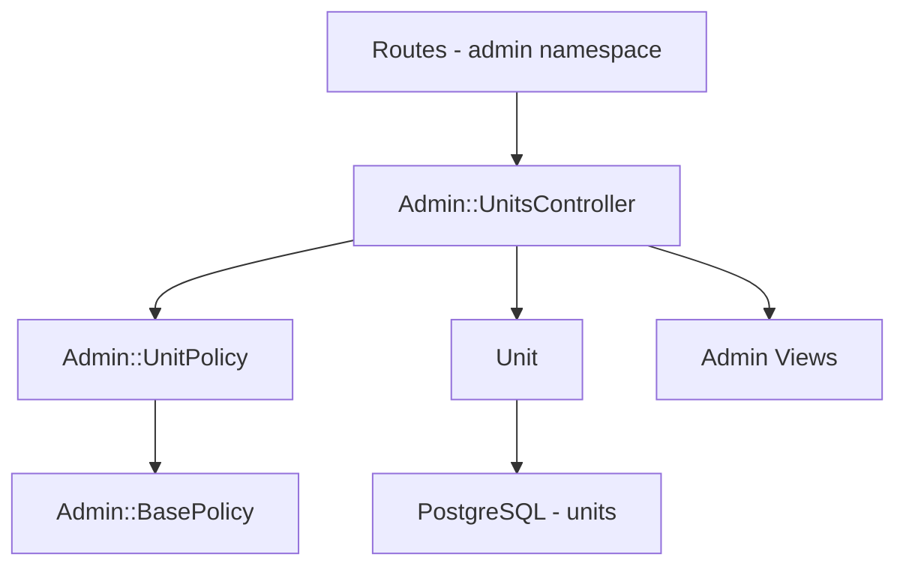

# Design Document

## Overview
Данный функционал добавляет CRUD-раздел управления Units (подразделениями) в административную панель Starmap. Администраторы получают возможность создавать, просматривать, редактировать и удалять Units через стандартный интерфейс админки. Параллельно выполняется удаление колонки `sort_order` из модели Unit как неиспользуемой.

Реализация следует существующим паттернам админ-панели (Technologies, Users, Quarters), обеспечивая единообразие UX и архитектуры.

### Goals
- Полный CRUD для Units в admin-панели с фильтрацией и пагинацией
- Удаление `sort_order` из модели и БД
- Защита от удаления Unit с привязанными командами

### Non-Goals
- Сортировка/перетаскивание Units (reorder)
- Массовые операции (batch delete/edit)
- Изменение публичных маршрутов Units (`/units`)

## Architecture

### Existing Architecture Analysis
Существующая админка построена по единообразному паттерну:
- `Admin::BaseController` → authenticate + admin layout + `skip_after_action :verify_policy_scoped`
- Авторизация через Pundit: `authorize [:admin, Model]` во всех actions
- `Admin::BasePolicy` → полный CRUD для `admin?` role
- Views: `page-header` → `card` → `table/form`, CSS-компонентная система

### Architecture Pattern & Boundary Map
Выбран паттерн: **Rails MVC CRUD** — прямое наследование существующих admin-контроллеров и политик.

- Domain boundary: admin-пространство, изолировано от публичных routes
- Existing patterns: `Admin::BaseController`, `Admin::BasePolicy`, view components
- New components: `Admin::UnitsController`, `Admin::UnitPolicy`, 5 views, sidebar link, i18n keys

### Technology Stack

| Layer | Choice / Version | Role in Feature | Notes |
|-------|------------------|-----------------|-------|
| Backend | Rails 8.1.1 MVC | CRUD controller, model cleanup | Следует паттерну Technologies |
| Authorization | Pundit | Role-based access control | `Admin::UnitPolicy < Admin::BasePolicy` |
| Data | PostgreSQL 15+ | Remove sort_order column | Миграция с `remove_column` |
| Frontend | Hotwire (ERB + CSS components) | Admin views | Копия паттерна Technologies views |
| i18n | I18n (en, ru) | Локализация интерфейса | ru.yml, en.yml |

## Requirements Traceability

| Requirement | Summary | Components | Interfaces |
|-------------|---------|------------|------------|
| 1.1 | Список Units с колонками | UnitsController#index, index.html.erb | — |
| 1.2 | Переход на страницу Unit | UnitsController#show, show.html.erb | — |
| 1.3 | Сортировка по name | Unit.ordered scope, controller sort | — |
| 1.4 | Ссылка на создание | index.html.erb | — |
| 2.1 | Создание Unit | UnitsController#create, _form.html.erb | — |
| 2.2 | Валидация duplicate name | Unit model validation | — |
| 2.3 | Валидация empty name | Unit model validation | — |
| 2.4 | Поля формы | _form.html.erb | — |
| 3.1 | Обновление Unit | UnitsController#update, _form.html.erb | — |
| 3.2 | Валидация duplicate name | Unit model validation | — |
| 3.3 | Pre-fill формы | edit.html.erb, _form.html.erb | — |
| 4.1 | Удаление Unit | UnitsController#destroy | — |
| 4.2 | Блокировка при наличии teams | UnitsController#destroy | — |
| 4.3 | Очистка unit_lead | Unit model association | — |
| 5.1 | Миграция remove sort_order | Migration | — |
| 5.2 | Очистка model references | Unit model | — |
| 5.3 | Order by name | Unit scope | — |
| 6.1 | Deny non-admin | Admin::UnitPolicy | — |
| 6.2 | CRUD только для admin | Admin::UnitPolicy, BaseController | — |

## Components and Interfaces

| Component | Domain/Layer | Intent | Req Coverage | Key Dependencies | Contracts |
|-----------|--------------|--------|--------------|------------------|-----------|
| Admin::UnitsController | Controller | CRUD endpoints для Units | 1-4, 6 | Unit (P0), Admin::UnitPolicy (P0) | API |
| Admin::UnitPolicy | Authorization | Доступ только для admin | 6 | Admin::BasePolicy (P0) | State |
| Unit model | Model | Удаление sort_order, обновление scope | 5 | — | State |
| Migration | Data | Удаление колонки sort_order | 5.1 | — | Batch |
| Admin views (5) | View | CRUD интерфейс | 1-4 | — | — |
| Sidebar link | View | Навигация в админке | 1 | Admin::UnitPolicy (P0) | — |
| i18n keys | Config | Локализация ru/en | 1-4 | — | — |

### Controller

**Admin::UnitsController** — наследует `Admin::BaseController`, полностью следует паттерну `TechnologiesController`.

| Field | Detail |
|-------|--------|
| Intent | CRUD-операции над Units в admin-панели |
| Requirements | 1.1–4.2, 6 |

**API Contract**:

| Method | Endpoint | Request | Response | Errors |
|--------|----------|---------|----------|--------|
| GET | /admin/units | params: active, name, page | HTML index | — |
| GET | /admin/units/:id | — | HTML show | 404 |
| GET | /admin/units/new | — | HTML form | — |
| POST | /admin/units | unit: {name, description, active, unit_lead_id} | redirect to show | 422 (validation) |
| GET | /admin/units/:id/edit | — | HTML form | 404 |
| PATCH | /admin/units/:id | unit: {name, description, active, unit_lead_id} | redirect to show | 422 (validation) |
| DELETE | /admin/units/:id | — | redirect to index | 422 (has teams) |

**Implementation Notes**:
- Destroy action вызывает `@unit.destroy`; наличие teams блокируется через `dependent: :restrict_with_error` на модели — `destroy` возвращает `false`, контроллер редиректит с alert (паттерн TechnologiesController)
- Фильтры: `filter_by_active`, `filter_by_name`; сортировка: `order(:name)`
- Strong params: `name`, `description`, `active`, `unit_lead_id`

### Authorization

**Admin::UnitPolicy** — пустой класс, наследует `Admin::BasePolicy` (полный CRUD для admin). Паттерн идентичен `Admin::TechnologyPolicy`.

### Model Changes

**Unit** — удаление sort_order:

| Изменение | Детали |
|-----------|--------|
| Удалить | `validates :sort_order, ...` |
| Удалить | `before_validation :set_default_sort_order` |
| Удалить | scope `ordered` с sort_order |
| Добавить | scope `ordered, -> { order(:name) }` |
| Изменить | `has_many :teams, dependent: :nullify` → `has_many :teams, dependent: :restrict_with_error` |

### Migration

- `remove_column :units, :sort_order, :integer`
- `remove_index :units, :sort_order` (если отдельный индекс)

### Views

Пять view-файлов, следующих паттерну Technologies:

| View | Назначение |
|------|------------|
| `index.html.erb` | Таблица Units с фильтрами (active, name), пагинация |
| `show.html.erb` | Детали Unit: name, description, active, unit_lead, created_at, updated_at |
| `new.html.erb` | Обёртка для `_form` |
| `edit.html.erb` | Обёртка для `_form` |
| `_form.html.erb` | Поля: name, description, active (select), unit_lead (collection_select из User) |

### Sidebar Navigation

Добавить ссылку на Units в `admin.html.erb` sidebar между Technologies и Users, аналогично существующим ссылкам с проверкой `policy([:admin, Unit]).index?`.

### i18n

Ключи для `admin.units` в `config/locales/ru.yml` и `en.yml`:
- `admin.sidebar.units` — название ссылки в sidebar
- `admin.units.*` — аналогичная структура `admin.technologies.*` (title, new, edit, create, etc.)
- `admin.units.attributes.*` — name, description, active, unit_lead
- `admin.units.cannot_delete_with_teams` — сообщение об ошибке удаления

## Data Models

### Изменения в модели Unit

**До**:
| Column | Type | Constraints |
|--------|------|-------------|
| name | string | NOT NULL, unique |
| description | text | nullable |
| active | boolean | default: true |
| sort_order | integer | default: 0 |
| unit_lead_id | bigint | FK → users |

**После**:
| Column | Type | Constraints |
|--------|------|-------------|
| name | string | NOT NULL, unique |
| description | text | nullable |
| active | boolean | default: true |
| unit_lead_id | bigint | FK → users |

## Error Handling

### Error Categories

**User Errors (422)**:
- Duplicate name → field-level validation error на форме
- Empty name → field-level validation error на форме
- Delete with teams → alert-сообщение при редиректе на index

**Not Found (404)**:
- Unknown unit ID → `rescue_from ActiveRecord::RecordNotFound` в BaseController

## Testing Strategy

### Request Specs (`spec/requests/admin/units_spec.rb`)
- Index: отображение списка, фильтрация, сортировка, пагинация
- Show: отображение деталей Unit
- Create: успешное создание, валидация duplicate/empty name
- Update: успешное обновление, валидация duplicate name
- Destroy: успешное удаление без teams, отказ при наличии teams
- Authorization: не-admin не имеет доступа к любому действию

### Policy Specs (`spec/policies/admin/unit_policy_spec.rb`)
- Admin имеет доступ ко всем действиям
- Non-admin не имеет доступа

**Total**: ~15-20 test cases, следует паттерну `spec/requests/admin/technologies_spec.rb`
