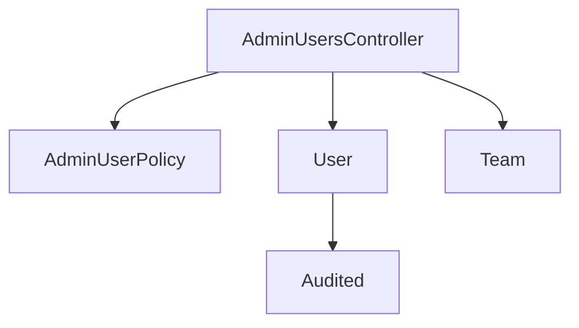

# Design Document

---
**Purpose**: Provide sufficient detail to ensure implementation consistency across different implementers, preventing interpretation drift.
---

## Overview

Система управления пользователями в административной панели. Функциональность включает листинг, просмотр карточки, создание, редактирование и деактивацию пользователей. Доступ ограничен ролью admin.

### Goals
- Предоставить администраторам полный контроль над учетными записями пользователей
- Обеспечить безопасное управление ролями и статусами
- Поддержать существующие паттерны Rails admin panel (plain ERB)

### Non-Goals
- Отправка email уведомлений при создании пользователя
- Самостоятельная регистрация пользователей
- ViewComponent — не требуется переиспользуемость

## Architecture

### Existing Architecture Analysis

Проект использует стандартную Rails MVC архитектуру с admin namespace. Существующие контроллеры (`Admin::QuartersController`) следуют паттерну:
- Admin::BaseController обеспечивает аутентификацию и layout
- Pundit policies определяют авторизацию
- Plain ERB шаблоны с component CSS classes
- Kaminari для pagination

### Architecture Pattern & Boundary Map



**Architecture Integration**:
- Pattern: Standard Rails CRUD with Admin namespace
- Admin::UsersController extends Admin::BaseController
- Admin::UserPolicy ensures admin-only access
- Views: Plain ERB templates (no ViewComponent)

### Technology Stack

| Layer | Choice | Role in Feature | Notes |
|-------|--------|-----------------|-------|
| Backend | Rails 8.1.1 | Controller, Policy | Existing stack |
| Authorization | Pundit | Admin::UserPolicy | admin-only access |
| Views | Plain ERB | UI rendering | Component CSS system |
| Data | PostgreSQL | User persistence | Existing schema |

## Requirements Traceability

| Requirement | Summary | Components | Interfaces |
|-------------|---------|------------|------------|
| 1 | Листинг пользователей | AdminUsersController#index, index.html.erb | GET /admin/users |
| 2 | Карточка пользователя | AdminUsersController#show, show.html.erb | GET /admin/users/:id |
| 3 | Форма редактирования | AdminUsersController#edit, _form.html.erb | GET/PATCH /admin/users/:id |
| 4 | Создание пользователя | AdminUsersController#new/create, _form.html.erb | GET/POST /admin/users |
| 5 | Деактивация | AdminUsersController#update (status) | PATCH /admin/users/:id |
| 6 | Управление ролями | AdminUserPolicy, _form.html.erb | Role validation |
| 7 | Авторизация | AdminUserPolicy | Pundit |

## Components and Interfaces

| Component | Domain/Layer | Intent | Req Coverage | Key Dependencies |
|-----------|--------------|--------|--------------|------------------------|
| AdminUsersController | Backend | CRUD operations for users | 1-5 | Admin::UserPolicy, User |
| AdminUserPolicy | Authorization | Admin-only access control | 7 | User |
| app/views/admin/users/ | UI | ERB templates | 1-4 | Component CSS |

### Backend

#### AdminUsersController

| Field | Detail |
|-------|--------|
| Intent | CRUD операции для управления пользователями |
| Requirements | 1.1, 1.2, 1.3, 1.4, 1.5, 2.1, 2.2, 2.3, 3.1-3.7, 4.1-4.3, 5.1-5.4, 6.1-6.4, 7.1-7.3 |

**Responsibilities & Constraints**
- RESTful controller в admin namespace
- Pundit policy scoped к admin
- Strong parameters
- Pagination через Kaminari (PER_PAGE = 25)

**Dependencies**
- Inbound: Admin::BaseController — layout, auth (P0)
- Outbound: Admin::UserPolicy — authorization (P0)
- Outbound: User — data model (P0)
- External: Devise — authentication (P0)

##### Actions

| Method | Action | Authorization | Response |
|--------|--------|--------------|----------|
| GET | index | AdminUserPolicy#index? | Render users list |
| GET | new | AdminUserPolicy#new? | Render create form |
| POST | create | AdminUserPolicy#create? | Create + redirect or render |
| GET | show | AdminUserPolicy#show? | Render user details |
| GET | edit | AdminUserPolicy#edit? | Render edit form |
| PATCH | update | AdminUserPolicy#update? | Update + redirect or render |

##### Parameters (Strong Parameters)

```ruby
def user_params
  params.require(:user).permit(
    :email,
    :first_name,
    :last_name,
    :position,
    :role,
    :team_id,
    :active,
    :password,
    :password_confirmation
  )
end
```

**Implementation Notes**
- Sorting: params[:sort] with direction (asc/desc)
- Filtering: params[:role], params[:status], params[:search]
- Pagination: Kaminari page(params[:page]).per(PER_PAGE)

#### AdminUserPolicy

| Field | Detail |
|-------|--------|
| Intent | Enforce admin-only access to user management |
| Requirements | 7.1, 7.2, 7.3 |

```ruby
class Admin::UserPolicy < Admin::BasePolicy
  private

  def can_manage?
    user&.admin?
  end
end
```

### Views

Following existing patterns from `app/views/admin/quarters/`:

```
app/views/admin/users/
├── index.html.erb   # User listing with table, filters, search
├── show.html.erb    # User details with audit info
├── new.html.erb     # Create form (renders _form)
├── edit.html.erb    # Edit form (renders _form)
└── _form.html.erb   # Shared form partial
```

#### index.html.erb Structure
- Page header with title + "New User" button
- Filter form (role, status, search)
- Table with columns: name, email, position, role, team, status, actions
- Pagination via Kaminari

#### show.html.erb Structure
- Page header with title + Edit button
- User attributes card (name, email, position, role, team, status)
- Sign-in info (current_sign_in_at, created_at)
- Audit trail (created_at, updated_at)

#### _form.html.erb Structure
- Fields: first_name, last_name, email, position, role, team_id, active
- Password fields only on new (password, password_confirmation)
- Validation error display
- Submit button + Cancel link

#### Form Validation Rules
- Role team_lead requires team_id presence
- Email format and uniqueness validation
- Password minimum length on create

## Data Models

### User Entity

| Attribute | Type | Notes |
|-----------|------|-------|
| id | UUID | Primary key |
| email | String | Unique, required |
| first_name | String | Required |
| last_name | String | Required |
| position | String | Optional |
| role | Enum | engineer, team_lead, unit_lead, admin |
| team | Belongs_to | Optional |
| active | Boolean | Default true |
| current_sign_in_at | DateTime | Devise trackable |
| created_at | DateTime | |
| updated_at | DateTime | |

### Consistency & Integrity
- Transaction: save/update within single transaction
- Validation: email uniqueness, role inclusion, team presence for team_lead
- Audit: track changes via Audited gem

## Error Handling

### Error Strategy
- Validation errors: Return form with errors (422)
- Authorization errors: 403 Forbidden
- Not found: 404 Not Found

### Error Categories
**User Errors** (422): Field validation → field-level error messages
**Auth Errors** (403): Not admin → "Доступ запрещен"
**Not Found** (404): User not found → redirect to index with alert

## Testing Strategy

### Unit Tests
- AdminUserPolicy: admin access, non-admin denial
- AdminUsersController: all CRUD actions with auth
- User model: validation rules

### System Tests
- User listing: pagination, sorting, filtering, search
- User creation: valid/invalid data, password validation
- User edit: field updates, validation errors
- User deactivation: status change, list visibility

### E2E/UI Tests
- Full create → view → edit → deactivate flow
- Admin-only access verification
