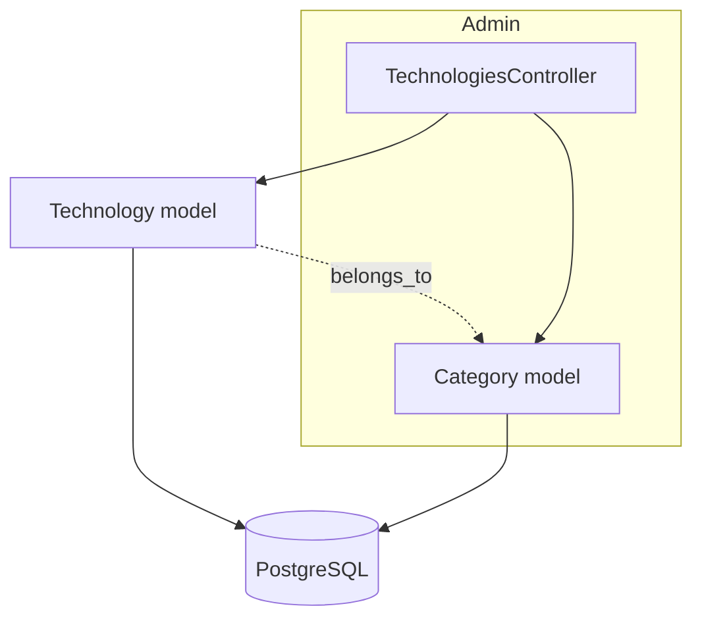
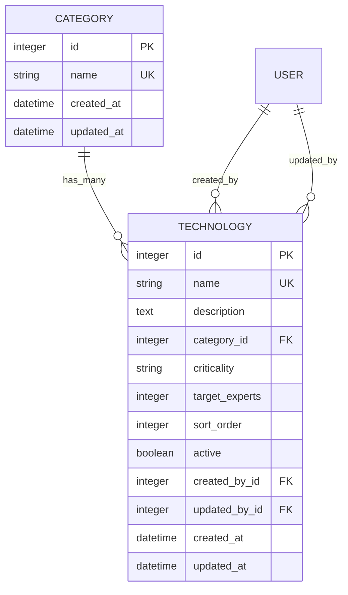
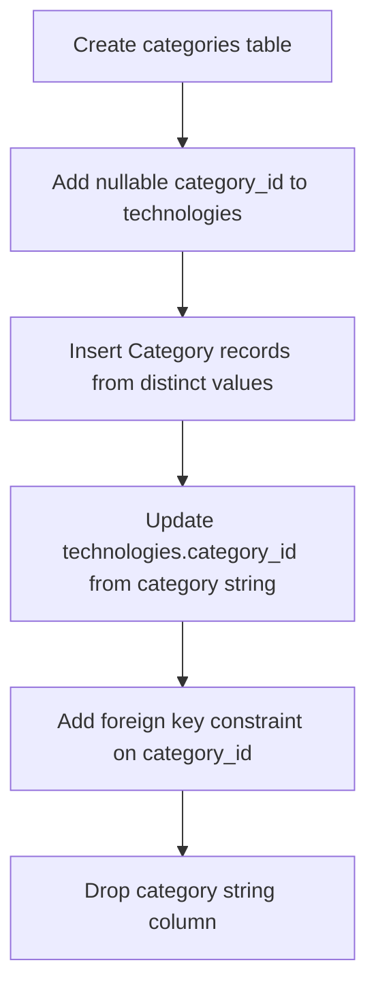

# Design Document

---
**Purpose**: Замена заглушки раздела «Компетенции» в админке на полнофункциональный CRUD с фильтрацией и рефакторинг категорий в отдельную сущность.

**Approach**:
- Расширение существующего admin namespace по паттерну UsersController
- Новая сущность Category с data migration из строкового поля
- i18n-переименование раздела

**Warning**: Подходит под Simple Addition/Extension — минимальная сложность.
---

## Overview

**Purpose**: Функциональный раздел «Компетенции» (Technologies) в админке для управления каталогом навыков команды.
**Users**: Admin-пользователи управляют технологиями (создание, редактирование, удаление, фильтрация).
**Impact**: Заменяет текущую заглушку на рабочий CRUD, добавляет сущность Category, меняет название раздела в UI.

### Goals
- Полнофункциональный CRUD технологий в админке по существующим паттернам
- Рефакторинг `category` из строки в отдельную сущность с data migration
- Фильтрация по active, названию, категории
- i18n-переименование раздела в «Компетенции»

### Non-Goals
- Отдельный CRUD для управления категориями (только select в форме технологий)
- Inline-создание новых категорий из формы Technology
- Изменение модели Technology или таблицы technologies

## Architecture

### Existing Architecture Analysis
- Admin namespace с BaseController, Pundit-авторизацией (`[:admin, Model]`), shared layout
- Существующие CRUD-паттерны: UsersController (110 строк), QuartersController (141 строка)
- Technology model с 294 строками бизнес-логики, строковое поле `category`

### Architecture Pattern & Boundary Map



**Architecture Integration**:
- Selected pattern: CRUD extension following existing admin controllers pattern
- Domain boundaries: Category — новая сущность, Technology — существующая модель (изменения минимальны)
- Existing patterns preserved: authorization, layout, pagination, filters, form rendering
- New components: Category model + migration
- Steering compliance: Rails MVC, Pundit, ViewComponent не требуется для этого feature

### Technology Stack

| Layer | Choice / Version | Role in Feature | Notes |
|-------|------------------|-----------------|-------|
| Backend | Rails 8.1.1 | CRUD controller, model, migration | Existing stack |
| Data | PostgreSQL 15+ | Category table, technology.category_id FK | New table |
| Authorization | Pundit | Admin-only access | Existing Admin::TechnologyPolicy |
| Pagination | Kaminari | Technology list pagination | PER_PAGE = 25 |
| Localization | I18n (en, ru) | Rename section to Competencies | en.yml, ru.yml |

## Requirements Traceability

| Requirement | Summary | Components | Interfaces |
|-------------|---------|------------|------------|
| 1.1 | i18n sidebar rename | en.yml, ru.yml | i18n key `admin.sidebar.technologies` |
| 1.2 | i18n page heading | index.html.erb | i18n key |
| 1.3 | No model/table rename | — | Constraint only |
| 2.1 | Category model | Category (model) | name, timestamps |
| 2.2 | has_many association | Category model | Association |
| 2.3 | belongs_to | Technology model | category_id FK |
| 2.4 | Destroy prevention | Category model | dependent: :restrict_with_error |
| 2.5 | Data migration | Migration file | String → FK |
| 2.6 | by_category scope | Technology model | Scope |
| 2.7 | Seeds update | db/seeds.rb | Category creation |
| 3.1 | Index list with columns | index.html.erb | Table |
| 3.2 | Create form | new.html.erb, _form.html.erb | Form |
| 3.3 | Edit form | edit.html.erb, _form.html.erb | Form |
| 3.4 | Delete action | TechnologiesController | button_to |
| 3.5 | Pagination | TechnologiesController | Kaminari |
| 3.6 | Default sort | TechnologiesController | sort_order, name |
| 3.7 | Name uniqueness validation | Technology model | Existing |
| 4.1 | Active filter | TechnologiesController, index.html.erb | select_tag |
| 4.2 | Name search filter | TechnologiesController, index.html.erb | text_field_tag |
| 4.3 | Category filter | TechnologiesController, index.html.erb | collection_select |
| 4.4 | AND logic | TechnologiesController | Chained scopes |
| 4.5 | Filter state in pagination | index.html.erb | Hidden fields in form |
| 5.1 | Admin-only access | Admin::TechnologyPolicy | Existing |
| 5.2 | Pundit denial | Admin::TechnologyPolicy | Existing |

## Components and Interfaces

| Component | Domain/Layer | Intent | Req Coverage | Key Dependencies | Contracts |
|-----------|--------------|--------|--------------|-------------------|-----------|
| Category | Model | Новая сущность категории | 2.1, 2.2, 2.4 | Technology (P0) | State |
| Technology model update | Model | belongs_to Category, updated scope | 2.3, 2.6 | Category (P0) | State |
| TechnologiesController | Controller | CRUD + фильтрация + сортировка | 3.1-3.6, 4.1-4.5, 5.1 | Technology, Category (P0) | API |
| Admin views (tech) | Views | Index, new, edit, _form | 1.2, 3.1-3.4, 4.1-4.5 | Controller (P0) | — |
| i18n locales | Config | Переименование, новые ключи | 1.1, 1.2 | — | — |
| Migration | Data | Category table + data migration | 2.3, 2.5 | — | Batch |
| Seeds | Data | Category records + associations | 2.7 | — | Batch |

### Model Layer

#### Category

| Field | Detail |
|-------|--------|
| Intent | Сущность категории технологий, нормализующая строковые значения |
| Requirements | 2.1, 2.2, 2.4 |

**Responsibilities & Constraints**
- Хранит уникальные имена категорий
- Запрещает удаление при наличии связанных технологий

**Dependencies**
- Inbound: Technology — belongs_to association (P0)
- Outbound: —
- External: —

**Contracts**: State [x]

##### State Management
- Attributes: `name` (string, not null, unique), `timestamps`
- Association: `has_many :technologies, dependent: :restrict_with_error`
- Validation: `name` presence + uniqueness (case-insensitive)

#### Technology (изменения)

| Field | Detail |
|-------|--------|
| Intent | Добавление belongs_to Category, обновление scope |
| Requirements | 2.3, 2.6 |

**Implementation Notes**
- Добавить `belongs_to :category, optional: true` (nullable для backward compatibility)
- Обновить scope `by_category`: заменить `where(category: category)` на `where(category_id: category_id)`
- Обновить все обращения к `technology.category` в коде на `technology.category&.name`:
  - `app/components/unit_technology_treemap_component.rb:40`
  - `app/components/red_zones_details_component.html.erb:34`
  - `app/components/key_person_risks_details_component.html.erb:34`
  - `app/components/team_skill_matrix_component.html.erb:27`
- Сохранить `by_category` как публичный scope для совместимости

### Controller Layer

#### Admin::TechnologiesController

| Field | Detail |
|-------|--------|
| Intent | CRUD операции + фильтрация + сортировка для технологий |
| Requirements | 3.1-3.6, 4.1-4.5, 5.1 |
| Owner / Reviewers | — |

**Responsibilities & Constraints**
- Все действия авторизованы через `authorize [:admin, Technology]`
- Фильтры сохраняются при пагинации через hidden fields в форме фильтров

**Dependencies**
- Inbound: Admin views (P0)
- Outbound: Technology model (P0), Category model (P1)
- External: — (нет новых внешних зависимостей)

**Contracts**: API [x]

##### API Contract

| Method | Endpoint | Request | Response | Errors |
|--------|----------|---------|----------|--------|
| GET | /admin/technologies | params: active, name, category_id, page, sort, direction | Paginated list + filters | 403 |
| GET | /admin/technologies/new | — | Form | 403 |
| POST | /admin/technologies | technology_params | Redirect to index | 403, 422 |
| GET | /admin/technologies/:id/edit | — | Form | 403, 404 |
| GET | /admin/technologies/:id | — | Show page | 403, 404 |
| PATCH | /admin/technologies/:id | technology_params | Redirect to show | 403, 404, 422 |
| DELETE | /admin/technologies/:id | — | Redirect to index | 403, 404 |

**Implementation Notes**
- `PER_PAGE = 25`
- Default sort: `sort_order asc, name asc`
- Private filter methods: `filter_by_active`, `filter_by_name`, `filter_by_category`
- Private sort method: `sort`
- `set_technology` callback для show/edit/update/destroy
- Strong params: `name`, `description`, `category_id`, `criticality`, `target_experts`, `sort_order`, `active`
- На create: `@technology.created_by = current_user`
- На update: callback `set_updated_by` уже существует в модели

### View Layer

#### index.html.erb

| Field | Detail |
|-------|--------|
| Intent | Листинг технологий с фильтрами и пагинацией |
| Requirements | 1.2, 3.1, 4.1-4.5 |

**Implementation Notes**
- Page header: `t("admin.technologies.index_title")` + «New» button
- Filters form: `form_tag admin_technologies_path, method: :get` с hidden fields для сохранения state при пагинации
  - `select_tag` для active (all/active/inactive)
  - `text_field_tag` для name search
  - `collection_select` для category из `Category.order(:name)`
  - Submit + Clear buttons
- Table columns: name, category (badge), criticality (badge), active (badge), target_experts, sort_order, actions (edit/delete)
- Pagination: `<%= paginate @technologies %>`
- Badges: `badge badge--success` (active), `badge badge--danger` (inactive), `badge badge--warning`/`badge badge--danger`/`badge badge--secondary` (criticality)

#### new.html.erb / edit.html.erb

| Field | Detail |
|-------|--------|
| Intent | Страницы создания и редактирования |
| Requirements | 3.2, 3.3 |

**Implementation Notes**
- Shared `_form` partial
- Page header с title + back link

#### _form.html.erb

| Field | Detail |
|-------|--------|
| Intent | Форма создания/редактирования технологии |
| Requirements | 3.2, 3.3, 3.7 |

**Implementation Notes**
- `form_with model: [:admin, @technology], local: true, class: "form--vertical"`
- Error display: `alert alert--error` с `full_messages`
- Fields: name (text), description (textarea), category (collection_select из Category.ordered), criticality (select high/normal/low), target_experts (number), sort_order (number), active (checkbox/toggle)
- Grid layout: `grid grid-cols-1 md:grid-cols-2 gap-6`
- Submit: `btn btn--primary` + `btn btn--secondary` cancel

#### show.html.erb

| Field | Detail |
|-------|--------|
| Intent | Просмотр деталей технологии |
| Requirements | 3.1 |

**Implementation Notes**
- Page header с title + edit/delete buttons
- Definition list: name, description, category, criticality (badge), active (badge), target_experts, sort_order, created_at, updated_at

### Config Layer

#### i18n (en.yml, ru.yml)

| Field | Detail |
|-------|--------|
| Intent | Новые ключи для технологий и переименование раздела |
| Requirements | 1.1, 1.2 |

**Implementation Notes**
- Изменить `admin.sidebar.technologies`: «Technologies» → «Competencies» (en), «Технологии» → «Компетенции» (ru)
- Добавить полноценное дерево `admin.technologies.*`: index_title, new, edit, show, create, update, destroy, filters, attributes, badges

#### config/routes.rb

| Field | Detail |
|-------|--------|
| Intent | Расширение маршрутов для CRUD |
| Requirements | 3.2-3.4 |

**Implementation Notes**
- Заменить `resources :technologies, only: [:index]` на `resources :technologies`

## Data Models

### Domain Model



### Logical Data Model

**Structure Definition**:
- Category 1:N Technology (nullable FK — backward compatibility)
- Technology uniqueness constraint on `name`
- Category uniqueness constraint on `name` (case-insensitive)

**Consistency & Integrity**:
- `dependent: :restrict_with_error` на Category → Technology
- Transaction boundary: стандартный Rails wrapping

### Physical Data Model

**categories table**:
```sql
CREATE TABLE categories (
    id          BIGSERIAL PRIMARY KEY,
    name        VARCHAR NOT NULL UNIQUE,
    created_at  TIMESTAMPTZ NOT NULL,
    updated_at  TIMESTAMPTZ NOT NULL
);
CREATE INDEX index_categories_on_name ON categories (name);
```

**technologies table changes**:
```sql
ALTER TABLE technologies ADD COLUMN category_id BIGINT REFERENCES categories(id);
-- data migration: map existing category strings to category_ids
ALTER TABLE technologies DROP COLUMN category;
```

### Migration Strategy



- Single reversible migration
- `up`: create table → insert categories → update FKs → drop old column
- `down`: add old column → copy names back → drop FK → drop categories table

## Error Handling

### Error Strategy
Следует существующим паттернам admin controllers.

### Error Categories and Responses
**User Errors (4xx)**: Unprocessable entity → form re-render с `alert alert--error` и `full_messages`; Not found → `head :not_found` (BaseController); Forbidden → Pundit auto-deny
**Validation Errors**: Name uniqueness → `validates_uniqueness_of :name` уже существует в модели; Category restrict → `dependent: :restrict_with_error` показывает flash alert

## Testing Strategy

### Unit Tests
- Category model: validations (presence, uniqueness), `dependent: :restrict_with_error`
- Technology model: `by_category` scope обновлён корректно, `belongs_to :category` работает

### Integration Tests
- Admin::TechnologiesController: index (фильтры, сортировка, пагинация), create, update, destroy
- Authorization: non-admin получает deny

### E2E/UI Tests
- Фильтрация по active/name/category с сохранением при пагинации
- CRUD flow: create → edit → delete technology

## Optional Sections

### Security Considerations
- Pundit: `Admin::TechnologyPolicy` уже наследует `Admin::BasePolicy` с проверкой `admin?`
- Strong params: whitelist всех разрешённых атрибутов в `technology_params`
- CSRF: `form_with` и `button_to` автоматически включают CSRF token

### Migration Strategy
Single reversible migration. Приложение в стадии разработки, production data нет. Реверс восстанавливает строковое поле и удаляет categories table.
