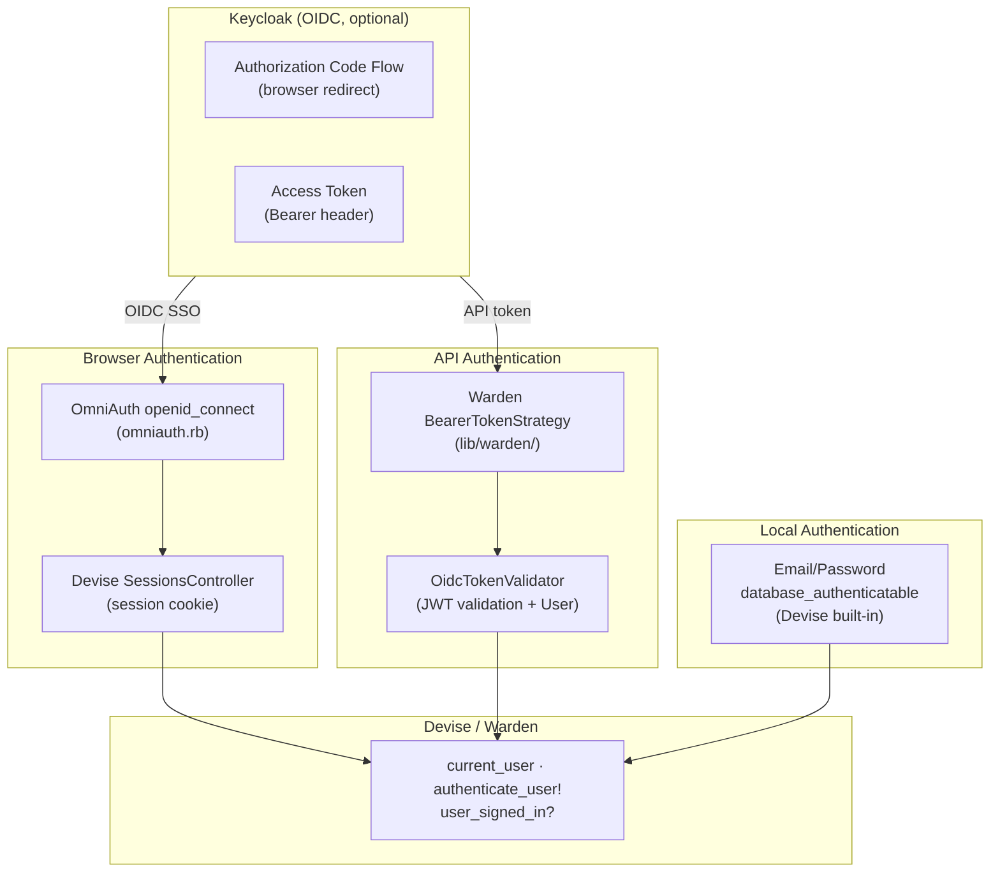

# Authentication Architecture

Starmap supports three authentication mechanisms:

1. **Email/Password** — session-based via Devise `database_authenticatable` (always available)
2. **OIDC SSO** — session-based via Devise + OmniAuth (optional, when Keycloak configured)
3. **API Bearer Token** — stateless via Warden strategy + `OidcTokenValidator` (optional, requires OIDC)

All resolve to the same `User` record and reuse Devise helpers (`current_user`, `authenticate_user!`).

## Overview



## Email/Password Authentication (Session)

**Always available** — works without OIDC configuration.

Standard Devise `database_authenticatable` with session cookies:

1. User enters email + password on `/users/sign_in`
2. Devise validates credentials against `encrypted_password` in database
3. Creates session, sets cookie
4. Subsequent requests: Warden deserializes user from session (`:fetch` event)

**Devise modules enabled** (see `app/models/user.rb`):
- `database_authenticatable` — email/password login
- `recoverable` — password reset via email
- `rememberable` — "remember me" cookie
- `trackable` — sign-in count, timestamps, IP addresses
- `validatable` — email/password validations
- `registerable` — self-registration (only when `REGISTRATION_ENABLED=true`)
- `omniauthable` — OIDC SSO (only when `OIDC_ENABLED=true`)

**Key files**:
- `app/models/user.rb` — Devise module configuration
- `app/controllers/sessions_controller.rb` — sign-in/sign-out (with OIDC logout support)
- `app/controllers/users/registrations_controller.rb` — sign-up (when enabled)

## OIDC SSO Authentication (Session, optional)

**Flow**: Authorization Code Grant with OIDC

1. User clicks "Sign in with SSO" → redirects to Keycloak
2. Keycloak authenticates user → redirects back with authorization code
3. OmniAuth exchanges code for ID token + access token
4. Devise creates session, sets cookie
5. Subsequent requests: Warden deserializes user from session (`:fetch` event)

**Configuration**: `config/initializers/omniauth.rb` — OmniAuth provider `:openid_connect` with `OidcConfig` values.

**Key files**:
- `config/initializers/auth.rb` — `OidcConfig` module
- `config/initializers/omniauth.rb` — OmniAuth provider setup
- `app/controllers/users/omniauth_callbacks_controller.rb` — callback handling
- `app/controllers/sessions_controller.rb` — custom sign-in/sign-out

## API Authentication (Bearer Token, optional)

**Flow**: Stateless token validation

1. Client obtains OIDC access token from Keycloak (e.g., via OAuth2 client credentials or authorization code)
2. Client sends `Authorization: Bearer <token>` in request header
3. Warden `BearerTokenStrategy` detects Bearer header, validates token
4. `OidcTokenValidator` decodes JWT, verifies signature (JWKS), checks claims, finds User
5. `success!(user)` — Devise/Warden recognize the user

**Design decisions**:
- **No session storage** — `store?` returns `false` in strategy. API clients don't get session cookies.
- **No trackable updates** — `devise.skip_trackable` prevents `sign_in_count` increment on every API request.
- **Request format** — MCP controller forces `request.format = :json` so Devise::FailureApp returns 401 (not redirect).

**Configuration**: `config/initializers/devise.rb` — registers `:bearer_token` strategy in Warden.

**Key files**:
- `lib/warden/bearer_token_strategy.rb` — Warden strategy
- `app/services/oidc_token_validator.rb` — JWT validation (JWKS cache, claim verification, user lookup)
- `app/controllers/mcp_controller.rb` — MCP endpoint using `authenticate_user!`

## OIDC Token Validator

`OidcTokenValidator` validates OIDC access tokens (JWTs) issued by Keycloak:

1. Extract `kid` from JWT header
2. Look up signing key from JWKS (cached 1 hour in `Rails.cache`)
3. Decode JWT with public key (RS256)
4. Verify claims: `exp` (not expired), `iss` (matches issuer), `aud` (matches client_id if present)
5. Find `User` by `email` claim

JWKS URI is discovered from `issuer/.well-known/openid-configuration` and cached 24 hours.

**Error hierarchy**:
- `OidcTokenValidator::InvalidToken` — generic validation failure
- `OidcTokenValidator::TokenExpired` — `exp` claim is in the past
- `OidcTokenValidator::InvalidIssuer` — `iss` doesn't match

## Configuration

All OIDC configuration is centralized in `OidcConfig` module (`config/initializers/auth.rb`):

| Method | ENV Variable | Required |
|---|---|---|
| `OidcConfig.issuer` | `OIDC_ISSUER` | yes |
| `OidcConfig.client_id` | `OIDC_CLIENT_ID` | yes |
| `OidcConfig.client_secret` | `OIDC_CLIENT_SECRET` | yes |
| `OidcConfig.redirect_uri` | `OIDC_REDIRECT_URI` | no |

When `OIDC_CLIENT_ID` is set, `OIDC_ISSUER` and `OIDC_CLIENT_SECRET` are also required.

Constants `OIDC_ENABLED` and `REGISTRATION_ENABLED` are derived from these values.

## Warden Strategy: BearerTokenStrategy

Registered as `:bearer_token` in Warden via `config/initializers/devise.rb`:

```ruby
config.warden do |manager|
  manager.default_strategies(scope: :user).unshift :bearer_token
end
```

**Strategy behavior**:
- `valid?` — returns `true` only if `Authorization` header starts with `Bearer `
- `authenticate!` — validates token via `OidcTokenValidator`, calls `success!(user)`
- `store?` — returns `false` (no session serialization for API clients)
- Sets `env["devise.skip_trackable"]` to prevent DB writes on each request

**Strategy order**: `bearer_token` is prepended (first) in the strategy list. If no Bearer header is present, `valid?` returns `false` and Warden falls through to `database_authenticatable` (email/password session).

## MCP Endpoint

`POST /mcp` — JSON-RPC endpoint for AI assistants (OpenCode, etc.).

**Auth flow**:
1. `McpController` inherits `ApplicationController`, uses `authenticate_user!`
2. `request.format = :json` is forced via `before_action` — ensures Devise returns 401 (not redirect) on auth failure
3. Bearer strategy validates OIDC access token
4. `current_user` is passed to MCP tools via `server_context`

**OAuth discovery endpoints** (for automated client configuration):
- `GET /.well-known/oauth-authorization-server` (RFC 8414) — proxies Keycloak OIDC metadata
- `GET /.well-known/oauth-protected-resource` (RFC 9728) — MCP resource metadata

## Future: Mobile App / Additional API Consumers

The Warden Bearer strategy is designed to scale to additional API consumers:

- **Mobile app**: Use standard OAuth2 Authorization Code Flow with PKCE → Keycloak issues access token → Bearer strategy validates it. Same `authenticate_user!` works for both browser and mobile.
- **Backend service (machine-to-machine)**: `client_credentials` grant produces tokens without `email` claim — current `OidcTokenValidator` expects user context. This requires a separate strategy or token validator.

For new API namespaces, add `before_action -> { request.format = :json }` to the base controller so Devise returns 401 instead of redirect.
