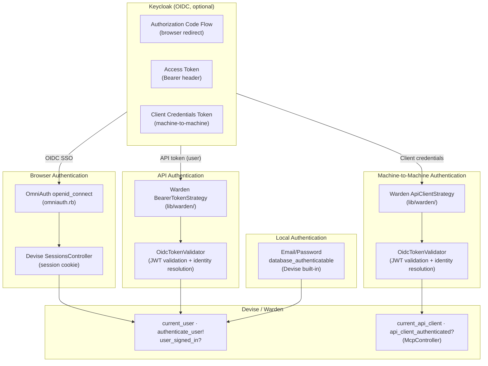

# Authentication Architecture

Starmap supports four authentication mechanisms:

1. **Email/Password** — session-based via Devise `database_authenticatable` (always available)
2. **OIDC SSO** — session-based via Devise + OmniAuth (optional, when Keycloak configured)
3. **API Bearer Token (User)** — stateless via Warden strategy + `OidcTokenValidator` (optional, requires OIDC)
4. **API Bearer Token (ApiClient)** — stateless via Warden strategy + `OidcTokenValidator` for machine-to-machine (optional, requires OIDC)

All User-based mechanisms resolve to the same `User` record. ApiClient tokens resolve to an `ApiClient` record for machine identity.

## Overview

## Email/Password Authentication (Session)

**Always available** — works without OIDC configuration.

Standard Devise `database_authenticatable` with session cookies:

1. User enters email + password on `/users/sign_in`
2. Devise validates credentials against `encrypted_password` in database
3. Creates session, sets cookie
4. Subsequent requests: Warden deserializes user from session (`:fetch` event)

**Devise modules enabled** (see `app/models/user.rb`):
- `database_authenticatable` — email/password login
- `recoverable` — password reset via email
- `rememberable` — "remember me" cookie
- `trackable` — sign-in count, timestamps, IP addresses
- `validatable` — email/password validations
- `registerable` — self-registration (only when `REGISTRATION_ENABLED=true`)
- `omniauthable` — OIDC SSO (only when `OIDC_ENABLED=true`)

**Key files**:
- `app/models/user.rb` — Devise module configuration
- `app/controllers/sessions_controller.rb` — sign-in/sign-out (with OIDC logout support)
- `app/controllers/users/registrations_controller.rb` — sign-up (when enabled)

## OIDC SSO Authentication (Session, optional)

**Flow**: Authorization Code Grant with OIDC

1. User clicks "Sign in with SSO" → redirects to Keycloak
2. Keycloak authenticates user → redirects back with authorization code
3. OmniAuth exchanges code for ID token + access token
4. Devise creates session, sets cookie
5. Subsequent requests: Warden deserializes user from session (`:fetch` event)

**Configuration**: `config/initializers/omniauth.rb` — OmniAuth provider `:openid_connect` with `OidcConfig` values.

**Key files**:
- `config/initializers/auth.rb` — `OidcConfig` module
- `config/initializers/omniauth.rb` — OmniAuth provider setup
- `app/controllers/users/omniauth_callbacks_controller.rb` — callback handling
- `app/controllers/sessions_controller.rb` — custom sign-in/sign-out

## API Authentication (Bearer Token, optional)

**Flow**: Stateless token validation via explicit Warden strategy call

1. Client obtains OIDC access token from Keycloak (e.g., via OAuth2 client credentials or authorization code)
2. Client sends `Authorization: Bearer <token>` in request header
3. MCP controller's `try_bearer_auth` calls `warden.authenticate(:bearer_token, scope: :user)`
4. `BearerTokenStrategy` validates token via `OidcTokenValidator`
5. `OidcTokenValidator` decodes JWT, verifies signature (JWKS), checks claims, resolves identity
6. If identity is `User` → `success!(user)` — Warden stores user in `:user` scope
7. If identity is `ApiClient` → strategy returns silently (type guard), controller falls through to `api_client_token` strategy

**Design decisions**:
- **No session storage** — `store?` returns `false` in strategy. API clients don't get session cookies.
- **No trackable updates** — `devise.skip_trackable` prevents `sign_in_count` increment on every API request.
- **Explicit strategy calls** — strategies are invoked by name, not through `default_strategies`. This avoids a known Warden `Config#dup` issue where per-scope strategy lists are lost during proxy initialization.
- **Type guard** — each strategy checks the identity type (`User` or `ApiClient`) and silently returns if the type doesn't match its scope, allowing the next strategy to try.

**Key files**:
- `lib/warden/bearer_token_strategy.rb` — Warden strategy for User Bearer tokens
- `app/services/oidc_token_validator.rb` — JWT validation (JWKS cache, claim verification, identity resolution)
- `app/controllers/mcp_controller.rb` — MCP endpoint with `authenticate_any!`

## OIDC Token Validator

`OidcTokenValidator` validates OIDC access tokens (JWTs) issued by Keycloak and resolves the identity:

1. Extract `kid` from JWT header
2. Look up signing key from JWKS (cached 1 hour in `Rails.cache`)
3. Decode JWT with public key (RS256)
4. Verify claims: `exp` (not expired), `iss` (matches issuer), `aud` (matches client_id if present)
5. **Identity resolution**:
   - If `email` claim present → find `User` by email (existing behavior)
   - If `email` absent → find `ApiClient` by `azp` matching `oidc_client_id` where `enabled = true`

JWKS URI is discovered from `issuer/.well-known/openid-configuration` and cached 24 hours.

**Error hierarchy**:
- `OidcTokenValidator::InvalidToken` — generic validation failure
- `OidcTokenValidator::TokenExpired` — `exp` claim is in the past
- `OidcTokenValidator::InvalidIssuer` — `iss` doesn't match

## Configuration

All OIDC configuration is centralized in `OidcConfig` module (`config/initializers/auth.rb`):

| Method | ENV Variable | Required |
|---|---|---|
| `OidcConfig.issuer` | `OIDC_ISSUER` | yes |
| `OidcConfig.client_id` | `OIDC_CLIENT_ID` | yes |
| `OidcConfig.client_secret` | `OIDC_CLIENT_SECRET` | yes |
| `OidcConfig.redirect_uri` | `OIDC_REDIRECT_URI` | no |

When `OIDC_CLIENT_ID` is set, `OIDC_ISSUER` and `OIDC_CLIENT_SECRET` are also required.

Constants `OIDC_ENABLED` and `REGISTRATION_ENABLED` are derived from these values.

## Warden Strategy: BearerTokenStrategy

Registered as `:bearer_token` in Warden (required from `config/initializers/devise.rb`). Called explicitly by the MCP controller via `warden.authenticate(:bearer_token, scope: :user)`.

**Strategy behavior**:
- `valid?` — returns `true` only if `Authorization` header starts with `Bearer `
- `authenticate!` — validates token via `OidcTokenValidator`, checks identity is `User`, calls `success!(user)`. If identity is `ApiClient` or an incompatible type, returns silently (allowing the next strategy to try).
- `store?` — returns `false` (no session serialization for API clients)
- Sets `env["devise.skip_trackable"]` to prevent DB writes on each request

## MCP Endpoint

`POST /mcp` — JSON-RPC endpoint for AI assistants (OpenCode, etc.) and machine clients.

**Auth flow**:
1. `McpController` tries session auth first (`user_signed_in?`), then Bearer token via explicit Warden strategy calls
2. Bearer token authentication: calls `warden.authenticate(:bearer_token, scope: :user)` first (User), then `warden.authenticate(:api_client_token, scope: :api_client)` (ApiClient)
3. `OidcTokenValidator` resolves identity — User or ApiClient — based on JWT claims (`email` present → User, `email` absent → ApiClient by `azp`)
4. `current_identity` (User or ApiClient) is passed to MCP tools via `server_context[:current_identity]`

**ApiClient policy routing**: `McpBaseTool#authorize` checks identity type — `ApiClient` routes to `ApiClient::TeamPolicy`, `User` routes to `TeamPolicy`.

**OAuth discovery endpoints** (for automated client configuration):
- `GET /.well-known/oauth-authorization-server` (RFC 8414) — proxies Keycloak OIDC metadata
- `GET /.well-known/oauth-protected-resource` (RFC 9728) — MCP resource metadata

## API Client Authentication (Machine-to-Machine)

**Flow**: Client credentials grant → stateless token validation

1. Admin creates `ApiClient` record via rails console with `oidc_client_id`, `permissions`, and `team_ids`
2. Client obtains access token from Keycloak via `client_credentials` grant
3. Client sends `Authorization: Bearer <token>` to MCP endpoint
4. Controller calls `warden.authenticate(:api_client_token, scope: :api_client)` — runs `ApiClientStrategy`
5. `OidcTokenValidator` decodes JWT — no `email` claim, resolves `ApiClient` by `azp` claim
6. `success!(api_client)` — Warden stores identity in `:api_client` scope, available via `warden.user(:api_client)`

**Design decisions**:
- **Separate Warden scope** (`:api_client`) — no risk of mixing identity types with `:user` scope
- **Explicit strategy calls** — strategies are called by name (`warden.authenticate(:api_client_token, ...)`) rather than relying on `default_strategies` config, avoiding a known Warden `Config#dup` issue where per-scope strategy lists are lost during proxy initialization
- **No Devise mapping** — ApiClient has no Devise modules, uses non-bang `warden.authenticate`
- **Manual 401** — controller handles unauthenticated response directly (no Devise FailureApp)
- **Policy namespace** — `ApiClient::TeamPolicy` etc. under `app/policies/api_client/`

**Configuration**: strategies are registered via `Warden::Strategies.add` in `lib/warden/` files (required from `config/initializers/devise.rb`). No `config.warden` scope config needed.

**Key files**:
- `app/models/api_client.rb` — machine identity model with permissions and team scoping
- `lib/warden/api_client_strategy.rb` — Warden strategy for ApiClient Bearer tokens
- `app/controllers/concerns/api_client_authenticatable.rb` — controller concern providing `current_api_client`
- `app/policies/api_client/` — policy namespace for ApiClient authorization

## Future: Mobile App / Additional API Consumers

The Warden Bearer strategy is designed to scale to additional API consumers:

- **Mobile app**: Use standard OAuth2 Authorization Code Flow with PKCE → Keycloak issues access token → Bearer strategy validates it. Same `authenticate_user!` works for both browser and mobile.
- **Backend service (machine-to-machine)**: Now supported via `ApiClient` identity and `client_credentials` grant. See API Client Authentication section above.

For new API namespaces, add `before_action -> { request.format = :json }` to the base controller so Devise returns 401 instead of redirect.
